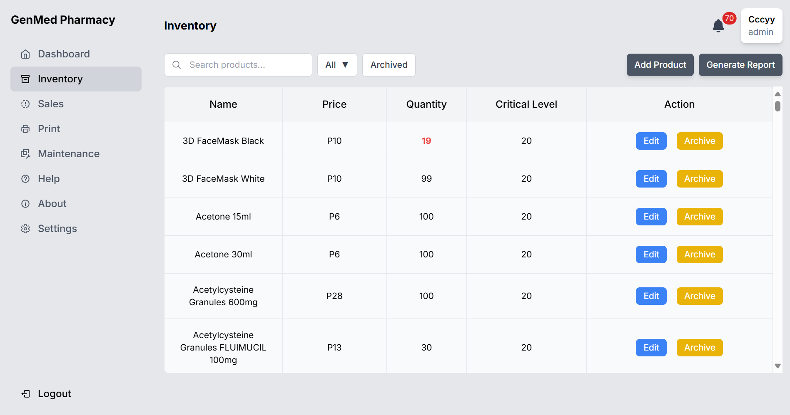

# Software Engineering 2 Project

Point of Sale and Inventory Management System for [business/company]

## User Interface

## Members

1. Cristobal, Armani
2. Eustaquio, Cyrill
3. Gillego, Gabriel
4. Mata, Francis
5. Naz, Robie

## Requirements

- Nodejs
- `.env` is needed in api folder directory --> for members, contact me for `.env`
- `npm i [dependencies]` see in `package.json`

## Usage

- cd to client directory and run using `npm run dev`
- cd to api directory and run using `node index.js or nodemon`